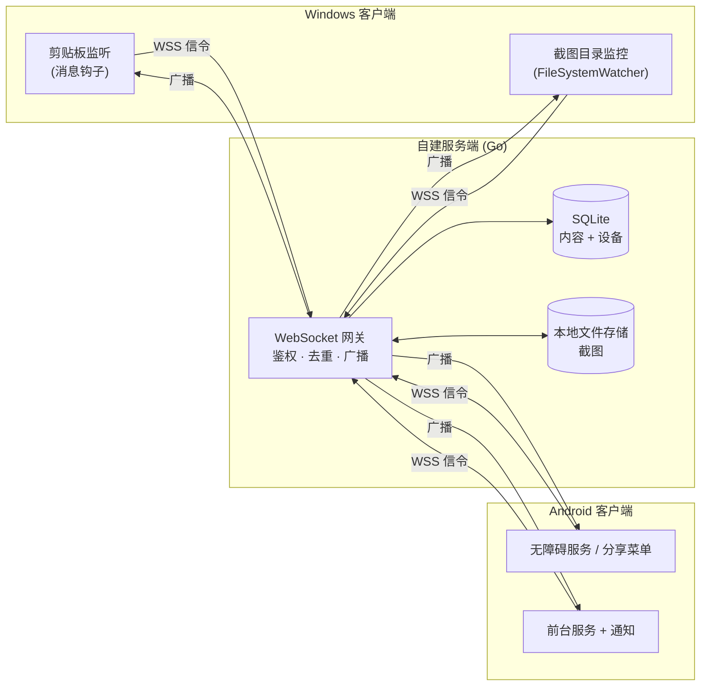
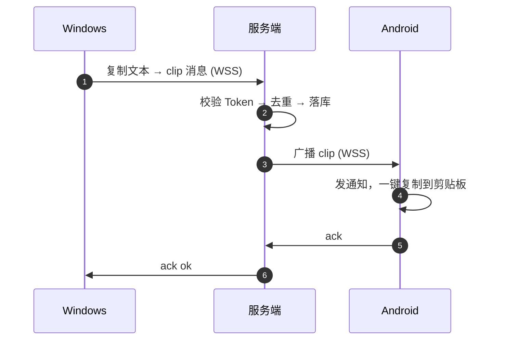
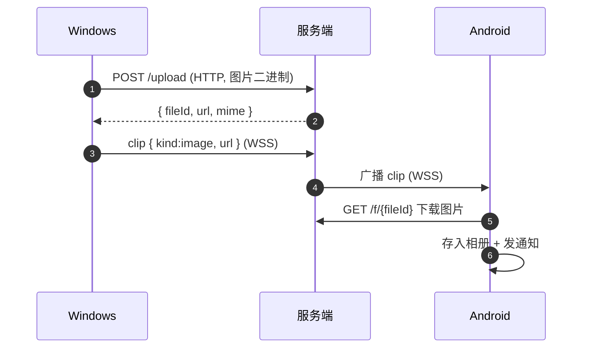

> [!IMPORTANT]
> **本项目由 AI 生成 · This project was generated by AI.**

# ClipBridge

**跨端剪贴板 / 截图同步，自建服务端，数据全掌控。**

你在 Windows 上复制一段文字、截一张图，它会**自动、实时**出现在你的 Android 手机上 —— 反过来也一样，全程无需手动点击"发送"。

<div align="center">

**Go + WebSocket + SQLite** · **C# / .NET 8** · **Kotlin / Compose**

</div>

---

## 为什么需要它

市面上剪贴板同步工具不少，但大多有这些痛点：数据要过第三方服务器、只能局域网、只支持文本、或者需要手动点"发送"。ClipBridge 的定位是：

| 诉求 | ClipBridge 的做法 |
| --- | --- |
| 隐私自主 | 服务端**自建**，内容只经过你自己的服务器 |
| 统一通道 | 文本 + 截图走**同一条链路** |
| 无感自动 | Windows 端**零操作**，复制即同步 |
| 多设备 | 中心化转发，天然支持 N 台设备互相同步 |

---

## 核心原理

### 1. 架构：中心化转发（Hub-and-Spoke）

所有客户端**只和服务端建立一条 WebSocket 长连接**，客户端之间互不直连。服务端负责三件事：**鉴权 → 去重 → 广播**。



### 2. 数据流：文本同步



### 3. 数据流：图片同步

图片二进制**不走 WebSocket**，而是先 HTTP 上传拿到 URL，WebSocket 只传轻量元数据。这样大文件不会阻塞长连接。



### 4. 防回环：同步工具最容易翻车的地方

跨端同步有个经典死循环：`A 复制 → B 写入剪贴板 → B 又上报 → A 再写入 → 无限循环`，几秒就能打爆服务器。ClipBridge 用**三道防线**堵死它：

```
┌─────────────────────────────────────────────────────────┐
│ 第一道  客户端 HashCache                                │
│   远端内容写入本地前，先把它的 hash 记进缓存            │
│   本地监听事件命中该 hash → 判定"这是自己写回的"，跳过  │
├─────────────────────────────────────────────────────────┤
│ 第二道  服务端 hash 去重                                │
│   同一 hash 在保留窗口内已广播过 → 直接忽略，返回 2003  │
├─────────────────────────────────────────────────────────┤
│ 第三道  msgId 幂等                                      │
│   客户端重发同一 msgId → 命中唯一约束，视为重复          │
└─────────────────────────────────────────────────────────┘
```

关键细节：Windows 端在写剪贴板**之前**先登记 hash，而不是之后 —— 否则写入触发的监听事件来不及查到，回环就漏了。

### 5. Android 的硬限制与取舍

这是整个项目唯一绕不过去的前提（详见 `docs/可行性报告.md`）：

> Android 10+ 起，后台应用**无法读取剪贴板**，且**没有任何权限可以申请**。

所以 Android 端按可靠性分了三档：

| 入口 | 可靠性 | 说明 |
| --- | --- | --- |
| 系统分享菜单 | ✅ 100% | 截图后「分享 → ClipBridge」，零权限零限制 |
| 通知一键复制 | ✅ 100% | 接收下行内容的标准方式 |
| 无障碍服务 | ⚠️ 受厂商影响 | 唯一免 Root 的**全自动**上行方案 |

---

## 特性

- ✅ 文本 / 图片**双向实时**同步
- ✅ **离线队列**：对方离线时暂存，上线自动补推（TTL 24h）
- ✅ 端到端加密（可选，AES-256-GCM，服务端只做密文盲转发）
- ✅ 敏感内容正则过滤 + 应用排除列表
- ✅ 历史记录自动过期（默认 7 天）
- ✅ 单二进制部署，SQLite 零运维
- ✅ 配对码一次性 + HMAC Token 鉴权 + 每设备限流

---

## 快速开始

### 服务端（Docker 一键）

```bash
cd deploy/docker
cp .env.example .env
# 编辑 .env，填两项：
#   CLIPBRIDGE_JWT_SECRET      → openssl rand -hex 32
#   CLIPBRIDGE_PUBLIC_BASE_URL → 对外访问地址（须 HTTPS）
docker compose up -d --build
docker compose logs -f clipbridge   # 这里会打印一次性配对码
```

或本机直接跑（需 Go 1.22+）：

```bash
cd server
go run ./cmd/clipbridge -config config.example.yaml
```

### 客户端

- **Windows**：`cd clients/windows/src && dotnet publish -c Release -r win-x64 --self-contained true -p:PublishSingleFile=true`，运行后填入服务端地址 + 配对码即可。
- **Android**：工程骨架已就位，Kotlin 源码仍在实现中。

> 完整的环境搭建、部署、排障见 `docs/开发指南.md`。

---

## 平台能力

| 能力 | Windows | Android |
| --- | --- | --- |
| 监听剪贴板文本 | ✅ 系统原生通知，无感 | ⚠️ 后台受限，需无障碍服务 |
| 捕获截图 | ✅ 剪贴板位图 + 目录监控 | ⚠️ MediaProjection，重启后需重新授权 |
| 写入剪贴板 | ✅ 直接写入 | ⚠️ 改为「相册 + 通知一键复制」 |
| 可靠性兜底 | — | ✅ 系统分享菜单（零权限） |

---

## 目录结构

```
clipbridge/
├── server/                 # 服务端（Go）
│   ├── cmd/clipbridge/     # 入口
│   ├── internal/           # config / auth / hub / store / api / model
│   └── migrations/         # 建表 SQL
├── clients/
│   ├── windows/            # Windows 客户端（C# / .NET 8）
│   └── android/            # Android 客户端（Kotlin，骨架）
├── shared/protocol/        # 跨端协议（唯一基准）
├── deploy/                 # Nginx / systemd / Docker
├── docs/                   # 可行性报告 · 开发指南 · 项目状态
└── tools/                  # 冒烟测试脚本
```

---

## 文档

| 文档 | 内容 |
| --- | --- |
| `docs/可行性报告.md` | 技术可行性、风险分析与 Android 权限限制详解 |
| `docs/开发指南.md` | 环境搭建、部署、联调、故障排查 |
| `docs/项目状态.md` | 完成度、已知待办、设计决策记录 |
| `shared/protocol/PROTOCOL.md` | 跨端通信协议（唯一基准） |

---

## 安全提示

- 全链路必须 TLS（Android 9+ 默认禁止明文 HTTP）
- 敏感内容建议配置正则黑名单，避免密码 / 验证码被同步
- 服务端历史记录支持自动过期，可手动一键清空
