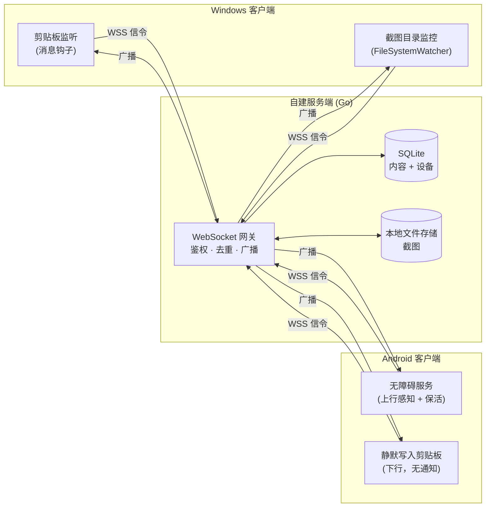
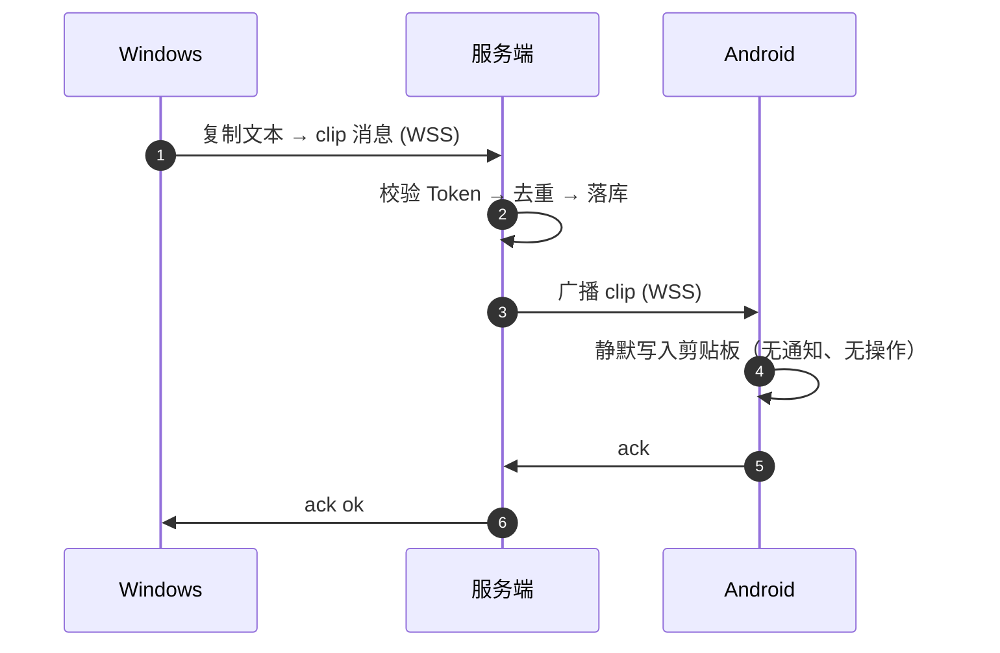
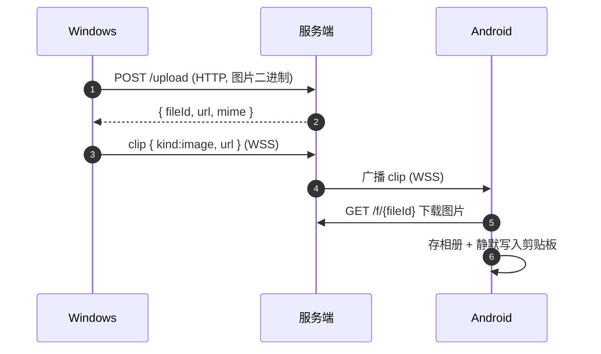

> [!IMPORTANT]
> **本项目由 AI 生成 · This project was generated by AI.**

# ClipBridge

**跨端剪贴板 / 截图同步，自建服务端，数据全掌控。**

你在 Windows 上复制一段文字、截一张图，它会**自动、实时**出现在你的 Android 手机上 —— 反过来也一样，全程无需手动点击"发送"。

<div align="center">

**Go + WebSocket + SQLite** · **C# / .NET 8** · **Kotlin / Compose**

**当前版本 v0.0.1** — [本版改动](#v001-改动内容) · [下载产物](../../releases/latest)

</div>

---

## 为什么需要它

市面上剪贴板同步工具不少，但大多有这些痛点：数据要过第三方服务器、只能局域网、只支持文本、或者需要手动点"发送"。ClipBridge 的定位是：

| 诉求 | ClipBridge 的做法 |
| --- | --- |
| 隐私自主 | 服务端**自建**，内容只经过你自己的服务器 |
| 统一通道 | 文本 + 截图走**同一条链路** |
| 无感自动 | Windows 端**零操作**，复制即同步 |
| 多设备 | 中心化转发，天然支持 N 台设备互相同步 |

---

## 核心原理

### 1. 架构：中心化转发（Hub-and-Spoke）

所有客户端**只和服务端建立一条 WebSocket 长连接**，客户端之间互不直连。服务端负责三件事：**鉴权 → 去重 → 广播**。



### 2. 数据流：文本同步



### 3. 数据流：图片同步

图片二进制**不走 WebSocket**，而是先 HTTP 上传拿到 URL，WebSocket 只传轻量元数据。这样大文件不会阻塞长连接。



### 4. 防回环：同步工具最容易翻车的地方

跨端同步有个经典死循环：`A 复制 → B 写入剪贴板 → B 又上报 → A 再写入 → 无限循环`，几秒就能打爆服务器。ClipBridge 用**三道防线**堵死它：

```
┌─────────────────────────────────────────────────────────┐
│ 第一道  客户端 HashCache                                │
│   远端内容写入本地前，先把它的 hash 记进缓存            │
│   本地监听事件命中该 hash → 判定"这是自己写回的"，跳过  │
├─────────────────────────────────────────────────────────┤
│ 第二道  服务端 hash 去重                                │
│   同一 hash 在保留窗口内已广播过 → 直接忽略，返回 2003  │
├─────────────────────────────────────────────────────────┤
│ 第三道  msgId 幂等                                      │
│   客户端重发同一 msgId → 命中唯一约束，视为重复          │
└─────────────────────────────────────────────────────────┘
```

关键细节：写剪贴板**之前**先登记 hash，而不是之后 —— 否则写入触发的监听事件来不及查到，回环就漏了。Windows 与 Android 两端都是这个顺序。

### 5. Android 的硬限制与取舍

这是整个项目唯一绕不过去的前提（详见 `docs/可行性报告.md`）：

> Android 10+ 起，后台应用**无法读取剪贴板**，且**没有任何权限可以申请**。
> AOSP `ClipboardService.clipboardAccessAllowed` 只对这几个身份放行读操作：
> 当前持有焦点的应用、默认输入法、SystemUI、ContentCapture 服务、Autofill 服务 ——
> **无障碍服务不在豁免名单里**。写入则不受限制（`OP_WRITE_CLIPBOARD` 直接放行）。

所以 ClipBridge 在 Android 上这样做：

| 方向 | 做法 | 可靠性 |
| --- | --- | --- |
| 下行（电脑 → 手机） | 收到即**静默写入系统剪贴板**，图片另存一份到相册 | ✅ 高（写入不受限） |
| 上行（手机 → 电脑） | 无障碍服务：先试读剪贴板；读不到就回退到"点复制前记下的选中文本" | ⚠️ 受厂商 ROM 影响 |
| 上行兜底 | 系统分享菜单「分享 → ClipBridge」，零权限零限制 | ✅ 100% |

上行之所以要做两路，是因为"读剪贴板"在很多机型上会被系统直接拒绝（返回 null），
此时只能靠无障碍事件还原用户复制的到底是什么。**两路都拿不到时宁可漏同步，
也不会把用户没复制的东西发出去。**

### 6. 只在"当前这一次操作"上生效

同步不是"把剪贴板里的东西都同步过去"，而是**只同步你此刻做的这一次复制/截图**：

- 客户端启动时把已存在于剪贴板 / 截图目录里的内容登记为历史，一律不上报
- 服务端默认**不做离线补推**（`limits.offline_replay_seconds: 0`）：
  设备离线期间攒下的内容直接丢弃，不会在它上线时一次性刷进来
- 需要容忍几秒网络抖动（重连空档里的内容不丢）时，把它设成 60~120 即可

---

## 特性

- ✅ 文本 / 图片**双向实时**同步
- ✅ 只同步**当前这一次**操作，历史内容不重发（补推窗口可配）
- ✅ Android 端**无任何常驻通知**：下行静默写剪贴板，连接由无障碍服务持有
- ✅ 端到端加密（可选，AES-256-GCM，服务端只做密文盲转发）
- ✅ 敏感内容正则过滤 + 应用排除列表
- ✅ 历史记录自动过期（默认 7 天）
- ✅ **单镜像**部署：Go 二进制与 Nginx 打在同一个镜像里，一条命令起服务
- ✅ SQLite 零运维，纯 Go 驱动，可静态编译、可交叉编译
- ✅ 配对码支持多台设备复用（也可配置永久固定码）+ HMAC Token 鉴权 + 每设备限流

---

## 版本

| 版本 | 日期 | 说明 |
| --- | --- | --- |
| **v0.0.1** | 2026-09-29 | 首个对外发布版本 |

本版是**第一个可用版本**：服务端、Windows / Android 客户端与 Docker 部署已闭环，
并在真实环境（飞牛 NAS + 家庭宽带 + 两台 Android）完整联调通过。

### v0.0.1 改动内容

#### 同步行为

- **只同步"当前这一次"操作**：客户端启动时把剪贴板里已有内容、截图目录里已有文件登记为历史，
  一律不上报，不会出现"一开机就把昨天复制的东西全推过去"
- 服务端默认**不做离线补推**（`limits.offline_replay_seconds: 0`）：
  设备离线期间积压的内容直接丢弃，上线时不会被旧内容刷屏。
  需要容忍几秒网络抖动（重连空档里的内容不丢）时改成 `60~120` 即可
- 配对码从"用一次即作废"改为**多台设备复用**，并支持配置**永久固定码**
  （8 位随机码按 10 次/分钟穷举一遍约需 19 年）
- `/api/pair` 补上**按来源 IP 的限流**（10 次/分钟）。
  注意实现里读取的是 Nginx 注入的 `X-Real-IP` / `X-Forwarded-For` ——
  只看 `RemoteAddr` 会把所有客户端合并成同一个限流桶，等于没限流

#### Android 客户端

- 上行改为**无障碍服务无感同步**，触发挂到**系统剪贴板变更通知**上：
  对任何 App 的任意一次复制都会触发，**不依赖目标 App 的任何私有实现**，
  微信 / QQ 这类自绘复制菜单同样生效
- 内容来源两级回退，都走无障碍标准接口：
  ① 无障碍事件里记下的选中区间 → ② 现场扫当前活动窗口的选中文本。
  两级都拿不到时**宁可漏同步，也不伪造内容**
- 下行**静默写入剪贴板**（文本直接写；图片存相册并以 `content://` URI 写入），
  **移除通知栏的「复制」按钮与「收到内容」通知**，默认零常驻通知
- 新增**本机截图上行**：`ContentObserver` 监听相册新增图片，按文件名 / 目录关键字
  （`screenshot` / `截屏` / `截图`…）识别后上传。此前只实现了下行存相册，上行只支持文本
- App 内新增「上行诊断」面板，把上行链路的关键节点就地渲染出来，
  排障不用连电脑抓 logcat

#### 服务端与部署

- **单镜像**：Go 二进制与 Nginx 打进同一个镜像，一个容器、两条挂载即可起服务；
  构建上下文改为仓库根目录，新增根级 `.dockerignore`
- 对外统一 **8443**：`CLIPBRIDGE_HTTPS_PORT` 同时决定容器内监听与宿主机映射，不会改一边忘一边
- 证书目录用 `CLIPBRIDGE_CERT_DIR` 注入（适配 acme.sh DNS-01，**不占用被封的 80 端口**）；
  无证书时不会崩，降级为"仅明文 HTTP"并在日志里说明
- 内置 `/f/` 图片静态服务（白名单正则 + 目录穿越防护），
  容器化后图片下载不再依赖宿主机 Nginx 去读数据卷
- 新增 `deploy/docker/deploy.sh`：幂等一键部署 —— 校验 `.env`、提示证书、
  清理上一版遗留的双容器、等待健康检查并打印配对码
- 版本号收敛到**单一来源** `server/internal/buildinfo`，
  `-version`、`/healthz`、启动日志读同一个值，可用 ldflags 覆盖

#### 修复

- **WebSocket 升级恒返回 500**：日志中间件包装 `ResponseWriter` 后丢失了 `http.Hijacker`，
  `websocket.Upgrader` 断言失败 —— 整个长连接链路此前从未真正通过。已显式转发 `Hijack` / `Flush`
- **Token 校验恒失败**：`fmt.Sscanf("%s|%d")` 里 `%s` 会贪婪读到空白符，把整个 payload 吞掉，
  导致所有带 Token 的接口一律 401。改用 `strings.Cut` 切分
- 图片 URL 丢失扩展名，历史记录与离线补推取不到图
- 无证书时 nginx 因 `upstream clipbridge_backend` 未定义而无法启动 ——
  本意是"没证书就降级为明文继续可用"，实际表现却是容器反复重启
- **Android 上行回退被静默取消的竞态**：一次复制会同时产生"点击了复制"（允许回退、到得晚）
  与"剪贴板变更"（不允许回退、到得早）两个信号，单槽调度里后到者会取消先到者，
  结果一次都发不出去。回退能力已改为粘性
- Windows 客户端 `HashCache` 使用了 `System.Threading.Lock`（.NET 9 才引入），
  而目标框架是 `net8.0-windows`，**编译不过**
- Windows 客户端 `Consume`（命中即移除）导致同一次复制被重复上报；`ForceSyncNow` 原为空操作

### 下载

产物见 [Releases 页面](../../releases/latest)：

| 产物 | 平台 | 说明 |
| --- | --- | --- |
| `clipbridge-server-0.0.1-linux-amd64.tar.gz` | Linux x86-64 | 静态二进制 + 配置样例 + 建表 SQL + systemd / nginx 配置 |
| `clipbridge-server-0.0.1-windows-amd64.zip` | Windows x86-64 | 同上，服务端本体 |
| `clipbridge-server-0.0.1-darwin-arm64.tar.gz` | macOS Apple Silicon | 同上 |
| `clipbridge-android-0.0.1.apk` | Android 8.0+ | 客户端安装包（debug 签名，可直接安装） |
| `SHA256SUMS.txt` | — | 上述文件的 SHA-256 校验和 |

> **Windows 客户端**本版未提供预编译产物（构建环境无 .NET SDK），
> 请按下方[客户端](#客户端)一节自行 `dotnet publish`。

**Docker 部署不需要下载二进制** —— 镜像里已包含服务端与 Nginx：

```bash
cd deploy/docker && cp .env.example .env && vi .env
docker compose up -d --build
```

---

## 快速开始

### 服务端（Docker 一键，单容器）

镜像里同时包含 **Go 二进制**与 **Nginx**，只需要一个容器、两条挂载。

```bash
cd deploy/docker
cp .env.example .env
# 编辑 .env，填三项：
#   CLIPBRIDGE_SERVER_NAME      → 你的域名
#   CLIPBRIDGE_PUBLIC_BASE_URL  → https://<域名>:8443  （必须带端口）
#   CLIPBRIDGE_JWT_SECRET       → openssl rand -hex 32
docker compose up -d --build
docker compose logs -f clipbridge   # 配对码打印在这里（多台设备可复用同一个码）
```

**端口**：家庭宽带的 80 / 443 通常被运营商封锁，所以对外统一用 **8443**。
`.env` 里的 `CLIPBRIDGE_HTTPS_PORT` 同时决定容器内监听端口与宿主机映射端口，改一处即可。
注意 `CLIPBRIDGE_PUBLIC_BASE_URL` 必须带上同一个端口号，否则客户端拿到的图片地址打不开。

**证书**：用 acme.sh 的 DNS-01 方式签发（不占用 80 端口），把证书装进 `CLIPBRIDGE_CERT_DIR` 指向的目录：

```bash
acme.sh --install-cert -d <域名> --ecc \
  --fullchain-file <CERT_DIR>/fullchain.pem \
  --key-file       <CERT_DIR>/privkey.pem \
  --reloadcmd      "docker restart clipbridge"
```

目录里没有证书时容器不会崩，会降级为"仅明文 HTTP"并在日志里说明 —— 但 Android 9+ 拒绝明文，所以手机端要等证书就位。

或本机直接跑（需 Go 1.22+）：

```bash
cd server
go run ./cmd/clipbridge -config config.example.yaml
```

### 客户端

- **Windows**：`cd clients/windows/src && dotnet publish -c Release -r win-x64 --self-contained true -p:PublishSingleFile=true`，运行后填入服务端地址 + 配对码即可。
- **Android**：可直接装 [Releases](../../releases/latest) 里的 `clipbridge-android-0.0.1.apk`；
  或自行 `cd clients/android && gradle assembleDebug`，产物在 `app/build/outputs/apk/debug/`。
  装好后打开 App → 填服务端地址（`https://<域名>:8443`）→ 配对 → **开启无障碍服务**，
  之后复制 / 截图即自动同步；截图同步需要在 App 内单独打开并授予相册读取权限。

> 完整的环境搭建、部署、排障见 `docs/开发指南.md`。

---

## 平台能力

| 能力 | Windows | Android |
| --- | --- | --- |
| 监听剪贴板文本 | ✅ 系统原生通知，无感 | ⚠️ 后台受限，靠无障碍事件还原 |
| 捕获截图 | ✅ 剪贴板位图 + 目录监控 | ✅ 监听相册新增图片（需相册读取权限，默认关闭） |
| 写入剪贴板 | ✅ 直接写入 | ✅ 静默写入（写入不受后台限制） |
| 常驻通知 | ✅ 无（托盘图标） | ✅ 默认无；可选开关换取更强保活 |
| 可靠性兜底 | — | ✅ 系统分享菜单（零权限） |

---

## 目录结构

```
clipbridge/
├── server/                 # 服务端（Go）
│   ├── cmd/clipbridge/     # 入口
│   ├── internal/           # config / auth / hub / store / api / model
│   └── migrations/         # 建表 SQL
├── clients/
│   ├── windows/            # Windows 客户端（C# / .NET 8）
│   └── android/            # Android 客户端（Kotlin / Compose）
├── shared/protocol/        # 跨端协议（唯一基准）
├── deploy/
│   ├── docker/             # 单镜像部署（Go + Nginx）
│   ├── nginx/              # 宿主机 Nginx 方案（非 Docker 时用）
│   └── systemd/            # 开机自启
├── docs/                   # 可行性报告 · 开发指南 · 项目状态
└── tools/                  # 冒烟测试脚本
```

---

## 文档

| 文档 | 内容 |
| --- | --- |
| `docs/可行性报告.md` | 技术可行性、风险分析与 Android 权限限制详解 |
| `docs/开发指南.md` | 环境搭建、部署、联调、故障排查 |
| `docs/项目状态.md` | 完成度、已知待办、设计决策记录 |
| `shared/protocol/PROTOCOL.md` | 跨端通信协议（唯一基准） |

---

## 安全提示

- 全链路必须 TLS（Android 9+ 默认禁止明文 HTTP）
- 敏感内容建议配置正则黑名单，避免密码 / 验证码被同步
- 服务端历史记录支持自动过期，可手动一键清空
