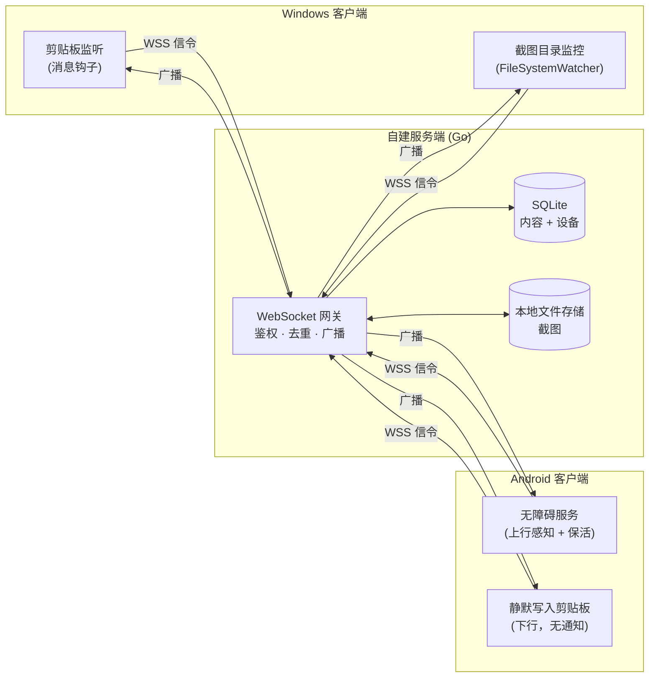
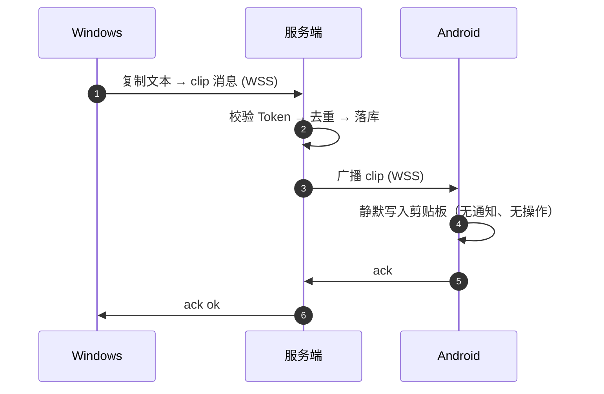
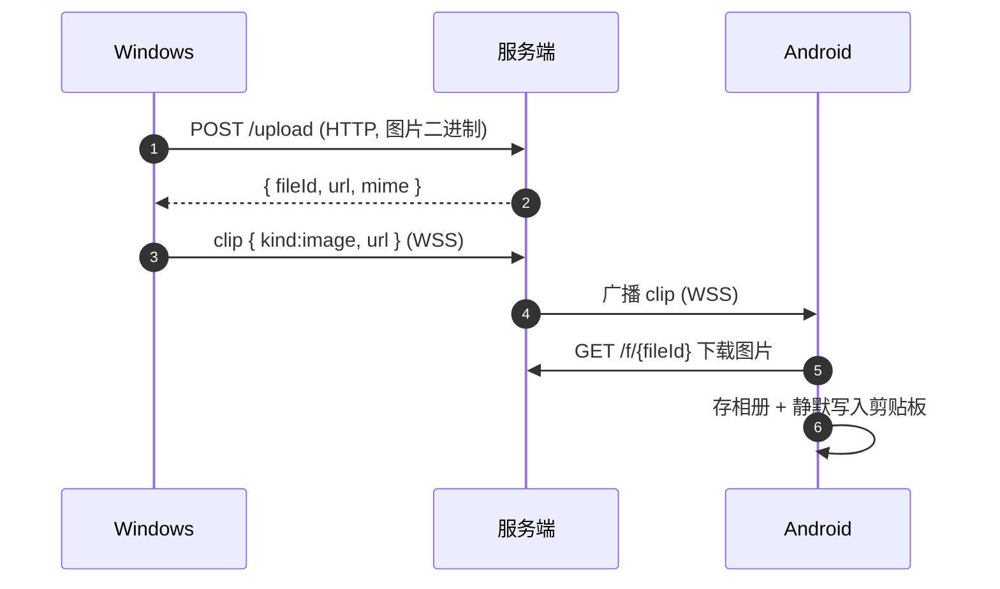

> [!IMPORTANT]
> **本项目由 AI 生成 · This project was generated by AI.**

# ClipBridge

**跨端剪贴板 / 截图同步，自建服务端，数据全掌控。**

你在 Windows 上复制一段文字、截一张图，它会**自动、实时**出现在你的 Android 手机上 —— 反过来也一样，全程无需手动点击"发送"。

<div align="center">

**Go + WebSocket + SQLite** · **C# / .NET 8** · **Kotlin / Compose**

</div>

---

## 为什么需要它

市面上剪贴板同步工具不少，但大多有这些痛点：数据要过第三方服务器、只能局域网、只支持文本、或者需要手动点"发送"。ClipBridge 的定位是：

| 诉求 | ClipBridge 的做法 |
| --- | --- |
| 隐私自主 | 服务端**自建**，内容只经过你自己的服务器 |
| 统一通道 | 文本 + 截图走**同一条链路** |
| 无感自动 | Windows 端**零操作**，复制即同步 |
| 多设备 | 中心化转发，天然支持 N 台设备互相同步 |

---

## 核心原理

### 1. 架构：中心化转发（Hub-and-Spoke）

所有客户端**只和服务端建立一条 WebSocket 长连接**，客户端之间互不直连。服务端负责三件事：**鉴权 → 去重 → 广播**。



### 2. 数据流：文本同步



### 3. 数据流：图片同步

图片二进制**不走 WebSocket**，而是先 HTTP 上传拿到 URL，WebSocket 只传轻量元数据。这样大文件不会阻塞长连接。



### 4. 防回环：同步工具最容易翻车的地方

跨端同步有个经典死循环：`A 复制 → B 写入剪贴板 → B 又上报 → A 再写入 → 无限循环`，几秒就能打爆服务器。ClipBridge 用**三道防线**堵死它：

```
┌─────────────────────────────────────────────────────────┐
│ 第一道  客户端 HashCache                                │
│   远端内容写入本地前，先把它的 hash 记进缓存            │
│   本地监听事件命中该 hash → 判定"这是自己写回的"，跳过  │
├─────────────────────────────────────────────────────────┤
│ 第二道  服务端 hash 去重                                │
│   同一 hash 在保留窗口内已广播过 → 直接忽略，返回 2003  │
├─────────────────────────────────────────────────────────┤
│ 第三道  msgId 幂等                                      │
│   客户端重发同一 msgId → 命中唯一约束，视为重复          │
└─────────────────────────────────────────────────────────┘
```

关键细节：写剪贴板**之前**先登记 hash，而不是之后 —— 否则写入触发的监听事件来不及查到，回环就漏了。Windows 与 Android 两端都是这个顺序。

### 5. Android 的硬限制与取舍

这是整个项目唯一绕不过去的前提（详见 `docs/可行性报告.md`）：

> Android 10+ 起，后台应用**无法读取剪贴板**，且**没有任何权限可以申请**。
> AOSP `ClipboardService.clipboardAccessAllowed` 只对这几个身份放行读操作：
> 当前持有焦点的应用、默认输入法、SystemUI、ContentCapture 服务、Autofill 服务 ——
> **无障碍服务不在豁免名单里**。写入则不受限制（`OP_WRITE_CLIPBOARD` 直接放行）。

所以 ClipBridge 在 Android 上这样做：

| 方向 | 做法 | 可靠性 |
| --- | --- | --- |
| 下行（电脑 → 手机） | 收到即**静默写入系统剪贴板**，图片另存一份到相册 | ✅ 高（写入不受限） |
| 上行（手机 → 电脑） | 无障碍服务：先试读剪贴板；读不到就回退到"点复制前记下的选中文本" | ⚠️ 受厂商 ROM 影响 |
| 上行兜底 | 系统分享菜单「分享 → ClipBridge」，零权限零限制 | ✅ 100% |

上行之所以要做两路，是因为"读剪贴板"在很多机型上会被系统直接拒绝（返回 null），
此时只能靠无障碍事件还原用户复制的到底是什么。**两路都拿不到时宁可漏同步，
也不会把用户没复制的东西发出去。**

### 6. 只在"当前这一次操作"上生效

同步不是"把剪贴板里的东西都同步过去"，而是**只同步你此刻做的这一次复制/截图**：

- 客户端启动时把已存在于剪贴板 / 截图目录里的内容登记为历史，一律不上报
- 服务端默认**不做离线补推**（`limits.offline_replay_seconds: 0`）：
  设备离线期间攒下的内容直接丢弃，不会在它上线时一次性刷进来
- 需要容忍几秒网络抖动（重连空档里的内容不丢）时，把它设成 60~120 即可

---

## 特性

- ✅ 文本 / 图片**双向实时**同步
- ✅ 只同步**当前这一次**操作，历史内容不重发（补推窗口可配）
- ✅ Android 端**无任何常驻通知**：下行静默写剪贴板，连接由无障碍服务持有
- ✅ 端到端加密（可选，AES-256-GCM，服务端只做密文盲转发）
- ✅ 敏感内容正则过滤 + 应用排除列表
- ✅ 历史记录自动过期（默认 7 天）
- ✅ **单镜像**部署：Go 二进制与 Nginx 打在同一个镜像里，一条命令起服务
- ✅ SQLite 零运维，纯 Go 驱动，可静态编译、可交叉编译
- ✅ 配对码一次性 + HMAC Token 鉴权 + 每设备限流

---

## 快速开始

### 服务端（Docker 一键，单容器）

镜像里同时包含 **Go 二进制**与 **Nginx**，只需要一个容器、两条挂载。

```bash
cd deploy/docker
cp .env.example .env
# 编辑 .env，填三项：
#   CLIPBRIDGE_SERVER_NAME      → 你的域名
#   CLIPBRIDGE_PUBLIC_BASE_URL  → https://<域名>:8443  （必须带端口）
#   CLIPBRIDGE_JWT_SECRET       → openssl rand -hex 32
docker compose up -d --build
docker compose logs -f clipbridge   # 这里会打印一次性配对码
```

**端口**：家庭宽带的 80 / 443 通常被运营商封锁，所以对外统一用 **8443**。
`.env` 里的 `CLIPBRIDGE_HTTPS_PORT` 同时决定容器内监听端口与宿主机映射端口，改一处即可。
注意 `CLIPBRIDGE_PUBLIC_BASE_URL` 必须带上同一个端口号，否则客户端拿到的图片地址打不开。

**证书**：用 acme.sh 的 DNS-01 方式签发（不占用 80 端口），把证书装进 `CLIPBRIDGE_CERT_DIR` 指向的目录：

```bash
acme.sh --install-cert -d <域名> --ecc \
  --fullchain-file <CERT_DIR>/fullchain.pem \
  --key-file       <CERT_DIR>/privkey.pem \
  --reloadcmd      "docker restart clipbridge"
```

目录里没有证书时容器不会崩，会降级为"仅明文 HTTP"并在日志里说明 —— 但 Android 9+ 拒绝明文，所以手机端要等证书就位。

或本机直接跑（需 Go 1.22+）：

```bash
cd server
go run ./cmd/clipbridge -config config.example.yaml
```

### 客户端

- **Windows**：`cd clients/windows/src && dotnet publish -c Release -r win-x64 --self-contained true -p:PublishSingleFile=true`，运行后填入服务端地址 + 配对码即可。
- **Android**：`cd clients/android && gradle assembleDebug`，产物在 `app/build/outputs/apk/debug/`。
  装好后打开 App → 配对 → **开启无障碍服务**，之后复制/截图即自动同步。

> 完整的环境搭建、部署、排障见 `docs/开发指南.md`。

---

## 平台能力

| 能力 | Windows | Android |
| --- | --- | --- |
| 监听剪贴板文本 | ✅ 系统原生通知，无感 | ⚠️ 后台受限，靠无障碍事件还原 |
| 捕获截图 | ✅ 剪贴板位图 + 目录监控 | ⚠️ MediaProjection，重启后需重新授权 |
| 写入剪贴板 | ✅ 直接写入 | ✅ 静默写入（写入不受后台限制） |
| 常驻通知 | ✅ 无（托盘图标） | ✅ 默认无；可选开关换取更强保活 |
| 可靠性兜底 | — | ✅ 系统分享菜单（零权限） |

---

## 目录结构

```
clipbridge/
├── server/                 # 服务端（Go）
│   ├── cmd/clipbridge/     # 入口
│   ├── internal/           # config / auth / hub / store / api / model
│   └── migrations/         # 建表 SQL
├── clients/
│   ├── windows/            # Windows 客户端（C# / .NET 8）
│   └── android/            # Android 客户端（Kotlin / Compose）
├── shared/protocol/        # 跨端协议（唯一基准）
├── deploy/
│   ├── docker/             # 单镜像部署（Go + Nginx）
│   ├── nginx/              # 宿主机 Nginx 方案（非 Docker 时用）
│   └── systemd/            # 开机自启
├── docs/                   # 可行性报告 · 开发指南 · 项目状态
└── tools/                  # 冒烟测试脚本
```

---

## 文档

| 文档 | 内容 |
| --- | --- |
| `docs/可行性报告.md` | 技术可行性、风险分析与 Android 权限限制详解 |
| `docs/开发指南.md` | 环境搭建、部署、联调、故障排查 |
| `docs/项目状态.md` | 完成度、已知待办、设计决策记录 |
| `shared/protocol/PROTOCOL.md` | 跨端通信协议（唯一基准） |

---

## 安全提示

- 全链路必须 TLS（Android 9+ 默认禁止明文 HTTP）
- 敏感内容建议配置正则黑名单，避免密码 / 验证码被同步
- 服务端历史记录支持自动过期，可手动一键清空
